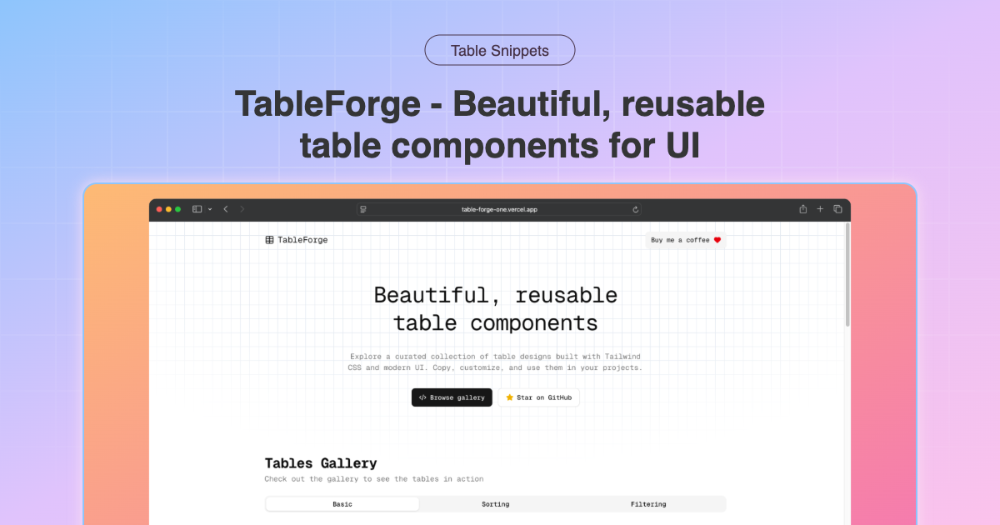
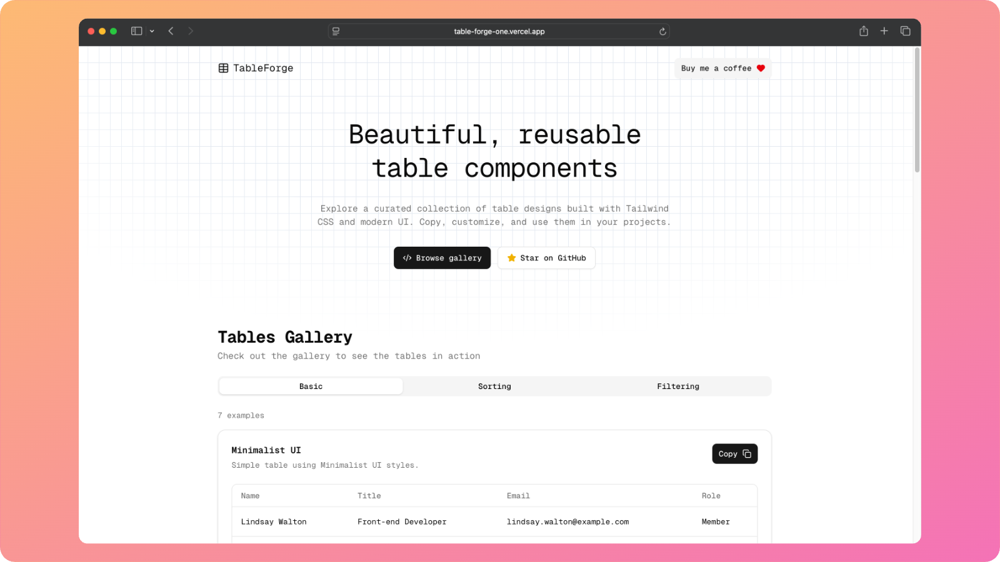
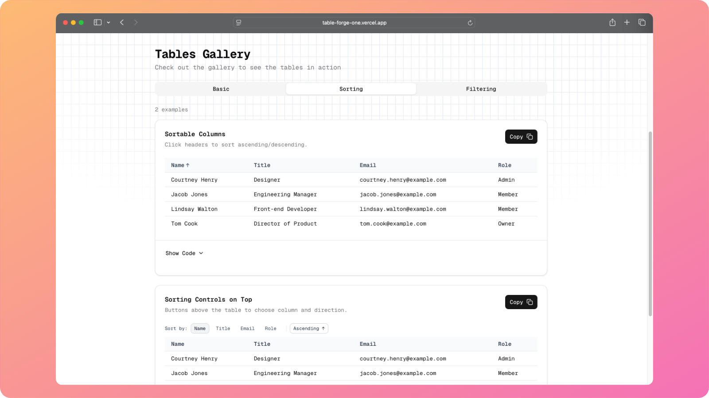

Ready-to-use, accessible table components built with Tailwind CSS and Modern UI. Browse examples, preview variations, copy the code in one click and use them in your projects. 100% Open Source and Free to use.

<!-- Screenshots -->
<p align="center">
  
</p>

<p align="center">
  
</p>

<p align="center">
  
</p>

## Features

- Minimal, production-ready examples — includes basic, sorting, and filtering tables
- One-click copy — grab JSX snippets instantly with copy-to-clipboard
- Responsive & dark-mode ready — tables adapt seamlessly to different themes and screens
- Utility-first styling — built entirely with Tailwind CSS v4
- Zero dependencies — just pure React + Tailwind, nothing extra

## Tech Stack

- Next.js 15 (App Router) + React 19 + TypeScript
- Tailwind CSS 4
- Shadcn Components
- MDX (via @next/mdx)
- Vercel Deployment

## Getting Started

Prerequisites: Node.js 18+.

```bash
# Install dependencies
npm install

# Start dev server
npm run dev

# Build and run production
npm run build && npm start
```

Open `http://localhost:3000` in your browser.

## How to Use

- Copy a table from the gallery and use it as-is in your project (change classes, data), or
- Build your own modular table using the examples below.

### 1) Define types and column/header config

```ts
// columns.ts
export type User = {
  id: string;
  name: string;
  email: string;
  role: "Owner" | "Admin" | "Member";
};

export type ColumnDef<T> = {
  /** Unique key into your row (required unless you provide valueGetter) */
  key?: keyof T & string;
  /** Header label */
  header: string;
  /** Optional function to derive the cell value (AG Grid–like) */
  valueGetter?: (row: T) => unknown;
  /** Optional custom renderer for final value */
  cellRenderer?: (value: unknown, row: T) => React.ReactNode;
  className?: string;
  headerClassName?: string;
  width?: number | string;
};

export const userColumns: ColumnDef<User>[] = [
  { key: "name", header: "Name" },
  { key: "email", header: "Email" },
  {
    key: "role",
    header: "Role",
    // Example of a custom renderer
    cellRenderer: (v) => (
      <span className="rounded bg-muted px-2 py-0.5">{v as string}</span>
    ),
  },
];
```

### 2) Create a reusable DataTable

```tsx
// DataTable.tsx
import * as React from "react";
import type { ColumnDef } from "./columns";

type DataTableProps<T> = {
  columns: ColumnDef<T>[];
  data: T[];
  getRowId?: (row: T, index: number) => React.Key;
  caption?: string;
  isLoading?: boolean;
  emptyState?: React.ReactNode;
  className?: string;
};

export function DataTable<T>(props: DataTableProps<T>) {
  const {
    columns,
    data,
    getRowId,
    caption,
    isLoading,
    emptyState = <div className="p-4 text-muted-foreground">No data</div>,
    className,
  } = props;

  if (isLoading) {
    return <div className="p-4 text-muted-foreground">Loading…</div>;
  }

  if (!data?.length) {
    return (
      <div className="rounded-lg border overflow-hidden">{emptyState}</div>
    );
  }

  return (
    <div className={`rounded-lg border overflow-auto ${className ?? ""}`}>
      <table className="w-full caption-bottom text-sm">
        {caption ? (
          <caption className="p-2 text-muted-foreground">{caption}</caption>
        ) : null}

        <thead className="[&_tr]:border-b">
          <tr className="border-b">
            {columns.map((c, i) => (
              <th
                key={c.key ?? `col-${i}`}
                className={`text-muted-foreground h-10 px-4 text-left align-middle font-medium ${
                  c.headerClassName ?? ""
                }`}
                style={c.width ? { width: c.width } : undefined}
                scope="col"
              >
                {c.header}
              </th>
            ))}
          </tr>
        </thead>

        <tbody className="[&_tr:last-child]:border-0">
          {data.map((row, i) => {
            const rowId = getRowId?.(row, i) ?? i;
            return (
              <tr
                key={rowId}
                className="hover:bg-muted/50 border-b transition-colors"
              >
                {columns.map((c, ci) => {
                  const raw = c.valueGetter
                    ? c.valueGetter(row)
                    : c.key
                    ? (row as any)[c.key]
                    : undefined;

                  return (
                    <td
                      key={(c.key ?? `c-${ci}`) as React.Key}
                      className={`p-4 align-middle ${c.className ?? ""}`}
                    >
                      {c.cellRenderer ? c.cellRenderer(raw, row) : (raw as any)}
                    </td>
                  );
                })}
              </tr>
            );
          })}
        </tbody>
      </table>
    </div>
  );
}
```

### 3) Usage

#### 3a) Client example with React Query (useQuery) or any data fetching library of your choice

```tsx
// UsersClient.tsx
"use client";
import { useQuery } from "@tanstack/react-query";
import { DataTable } from "./DataTable";
import { userColumns, type User } from "./columns";

export default function UsersClient() {
  const { data = [], isLoading } = useQuery<User[]>({
    queryKey: ["users"],
    queryFn: async () => (await fetch("/api/users")).json(),
  });

  return (
    <DataTable<User>
      columns={userColumns}
      data={data}
      isLoading={isLoading}
      caption="Users"
      getRowId={(r) => r.id}
    />
  );
}
```

#### 3b) Server component example (pass data from server)

```tsx
// UsersServer.tsx (server component)
import { DataTable } from "./DataTable";
import { userColumns, type User } from "./columns";

async function getUsers(): Promise<User[]> {
  // Replace with your DB call or external API
  return [
    {
      id: "1",
      name: "Lindsay Walton",
      email: "lindsay@example.com",
      role: "Member",
    },
    {
      id: "2",
      name: "Courtney Henry",
      email: "courtney@example.com",
      role: "Admin",
    },
  ];
}

export default async function UsersServer() {
  const users = await getUsers();
  return (
    <DataTable<User>
      columns={userColumns}
      data={users}
      caption="Users"
      getRowId={(r) => r.id}
    />
  );
}
```

## Contribution

Contributions are welcome! To add improvements or a new table example:

1. Fork the repo and create a feature branch.
2. Run locally with `npm run dev`.
3. Add your React component under `src/components/tables/`.
4. Create an MDX wrapper at `src/examples/tables/YourExample.mdx`:

```mdx
import ExampleCard from "@/components/ExampleCard";
import YourExample from "@/components/tables/YourExample";

export const meta = {
  id: "your-example-id",
  title: "Your Example",
  description: "Short description",
  group: "Basic", // or "Sorting" | "Filtering"
  codePath: "src/components/tables/YourExample.tsx",
};

export default function Example() {
  return (
    <ExampleCard title={meta.title} description={meta.description} codePath={meta.codePath}>
      <YourExample />
    </ExampleCard>
  );

}
```

5. Register it in `src/examples/index.ts` by importing the MDX file and pushing its `meta` + default export into the `examples` array.
6. Open a PR with a clear description and before/after screenshots.

## License

MIT. See `LICENSE` for details.
